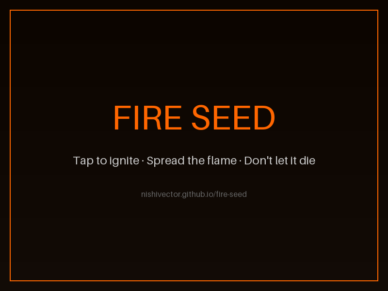

# Fire Seed

Tap to ignite. Spread the flame. Don't let it die.

A fire-spreading puzzle game where you tap to ignite fuel cells and chain reactions across the grid. Water cells block fire, damp cells slow it — plan your ignition point to set everything ablaze.

## How to Play

- **Tap** any fuel cell to ignite it
- Fire spreads to adjacent fuel cells automatically
- **Water** cells are permanent firebreaks — fire cannot cross them
- **Damp** cells take longer to ignite and slow the spread
- Ignite all fuel cells to clear the level

## Levels

1. **First Spark** — 5×5 grid, pure fuel, learn the spread
2. **The River** — 6×6 grid, water barriers divide the field
3. **Dampening** — 7×7 grid, damp cells slow your chain
4. **The Maze** — 8×8 grid, intricate water passages
5. **Inferno** — 9×9 grid, maximum complexity

## Built With

- [Three.js r183](https://threejs.org/)
- [Tone.js v15.1.22](https://tonejs.github.io/)

## Links

- **Play:** https://nishivector.github.io/fire-seed/
- **Repo:** https://github.com/nishivector/fire-seed
